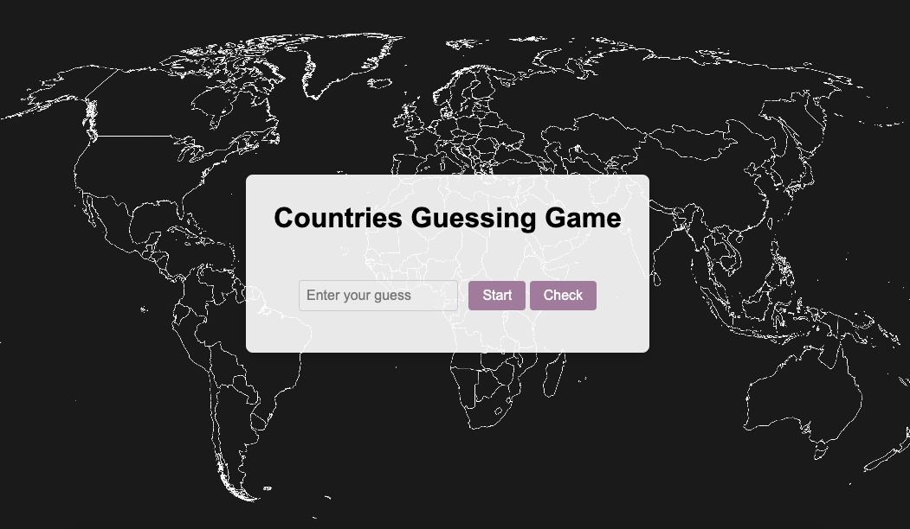

# Countries Guessing Game

## Description

The Countries Guessing Game is a web-based application that allows users to test their knowledge of countries around the world. Players are presented with a series of clues or hints about a country, and they must guess the correct country based on the information provided. The game is designed to be both educational and entertaining, helping players improve their geography skills while providing an engaging and interactive experience.

## Technologies Used

- HTML
- CSS
- JavaScript

## Getting Started

To get started with the Countries Guessing Game, follow these steps:

1. Select the "Start" button to begin the guessing game.
2. Write your guess at the input filed.
3. Check if your guess is correct or not.
4. Select the "Replay" button to play the game agin the game.

The project was deployed and can be viewed [Here](https://danahrb.github.io/guessing-game/)

## Future Updates

- Future Update 1: Implement a scoring system and leaderboard to track player performance.
- Future Update 2: Add more countries and difficulty levels to the game.

